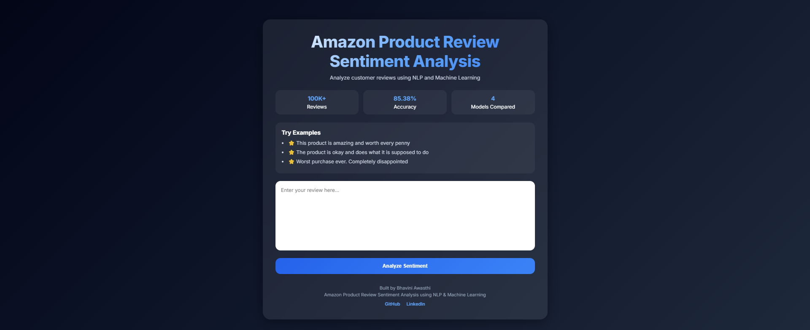
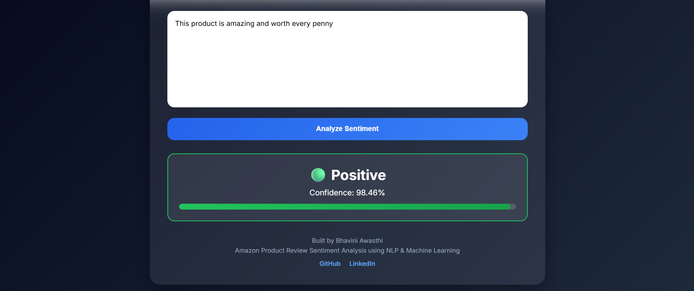
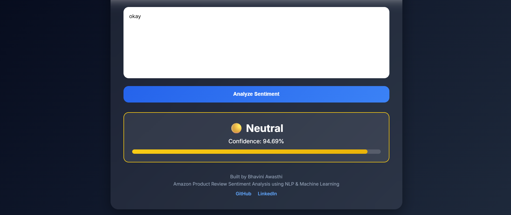
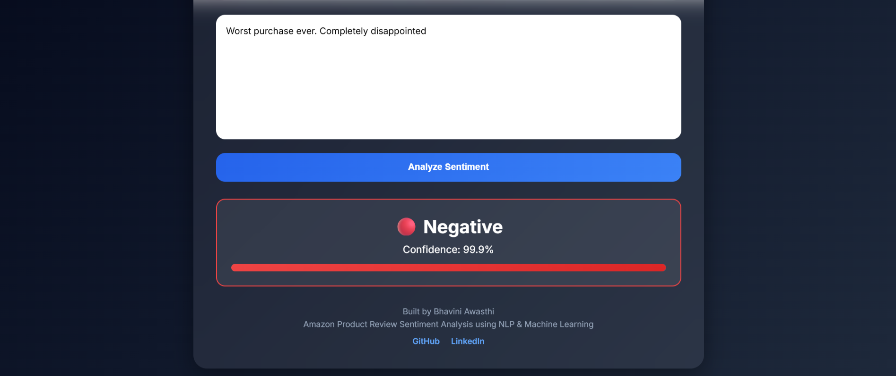

# Amazon Product Review Sentiment Analysis

[](https://amazon-product-review-sentiment-analysis.onrender.com/)
[]()
[]()
[]()

An end-to-end NLP-powered web application that analyzes Amazon product reviews and predicts customer sentiment as **Positive**, **Neutral**, or **Negative** using Machine Learning.

## Live Demo

**Try the application here:**

https://amazon-product-review-sentiment-analysis.onrender.com/

---

## Project Overview

Customer reviews contain valuable insights about products and user experiences. This project leverages Natural Language Processing (NLP) and Machine Learning techniques to automatically classify review sentiment.

The application processes raw review text, performs text preprocessing, converts text into numerical features using TF-IDF vectorization, and predicts sentiment using a trained machine learning model.

The project includes:

* Data Analysis and Visualization
* NLP Text Preprocessing
* TF-IDF Feature Engineering
* Multiple Machine Learning Models
* Model Comparison and Evaluation
* Flask Web Application
* Interactive User Interface
* Cloud Deployment on Render

---

## Features

* Predicts Positive, Neutral, and Negative sentiments
* Displays prediction confidence score
* Interactive review input interface
* Example reviews for quick testing
* Modern dark-themed responsive UI
* Fully deployed web application
* Real-time sentiment prediction

---

## Dataset

Amazon Fine Food Reviews Dataset

Dataset Statistics:

* Total Reviews Available: **568,454**
* Reviews Used for Training: **100,000**
* Features: Review Text, Summary, Score, Product Information

Sentiment Labels:

| Rating | Sentiment |
| ------ | --------- |
| 4-5    | Positive  |
| 3      | Neutral   |
| 1-2    | Negative  |

---

## NLP Pipeline

The following preprocessing steps were applied to review text:

1. Lowercasing
2. Removal of special characters
3. Tokenization
4. Stopword removal
5. Porter stemming
6. TF-IDF vectorization

Example:

Raw Review:

> I have bought several of the Vitality canned dog food products and found them all to be of good quality.

Processed Review:

> bought sever vital can dog food product found good qualiti

---

## Machine Learning Models Evaluated

| Model               | Accuracy |
| ------------------- | -------: |
| Linear SVM          |   85.38% |
| Logistic Regression |   85.34% |
| Random Forest       |   85.01% |
| Naive Bayes         |   81.12% |

### Final Model

**Logistic Regression**

Selected because it provides:

* Competitive accuracy
* Fast inference
* Probability estimates for confidence scoring
* Easier deployment

---

## Model Performance

Classification Accuracy:

**85.34%**

The model performs strongly on Positive and Negative reviews while maintaining support for Neutral sentiment classification.

---

## Tech Stack

### Machine Learning

* Python
* Scikit-Learn
* NLTK
* Pandas
* NumPy

### Web Development

* Flask
* HTML5
* CSS3

### Deployment

* Render

### Version Control

* Git
* GitHub

---

## Project Structure

```text
amazon-product-review-sentiment-analysis/

├── app/
│   ├── app.py
│   ├── static/
│   │   └── style.css
│   └── templates/
│       └── index.html
│
├── models/
│   ├── sentiment_model.pkl
│   └── tfidf_vectorizer.pkl
│
├── notebooks/
│   └── 01_EDA.ipynb
│
├── requirements.txt
├── README.md
└── .gitignore
```

---

## Application Screenshots

### Home Page



### Positive Prediction



### Neutral Prediction



### Negative Prediction



---

## How to Run Locally

### Clone Repository

```bash
git clone https://github.com/bhaviniawasthi1/amazon-product-review-sentiment-analysis.git
```

### Navigate to Project

```bash
cd amazon-product-review-sentiment-analysis
```

### Install Dependencies

```bash
pip install -r requirements.txt
```

### Run Application

```bash
cd app
python app.py
```

### Open Browser

```text
http://127.0.0.1:5000
```

---

## Future Improvements

* Deep Learning Models (LSTM, BERT)
* Aspect-Based Sentiment Analysis
* Review Summarization
* User Authentication
* Sentiment Analytics Dashboard
* Batch Review Prediction

---

## Author

### Bhavini Awasthi

GitHub:
https://github.com/bhaviniawasthi1

LinkedIn:
https://www.linkedin.com/in/bhavini-awasthi/

---

If you found this project interesting, consider giving it a ⭐ on GitHub.
